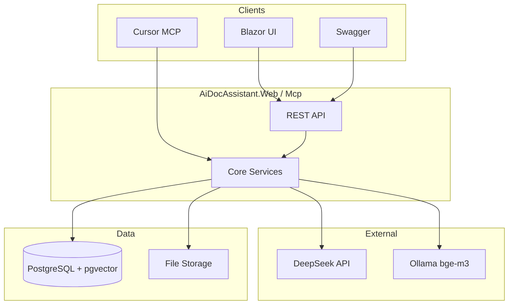

# AiDocAssistant

[](https://github.com/Vanchestery/AiDocAssistant/actions/workflows/ci.yml)
[](https://dotnet.microsoft.com/)
[](tests/AiDocAssistant.Tests/)
[](https://github.com/pgvector/pgvector)
[](docker-compose.yml)
[](LICENSE)

**AI-ассистент для автоматизации документооборота бэк-офиса** — от PDF до agent tools и MCP в Cursor.

Загрузка счетов и сканов → structured extraction (LLM) → RAG-чат с **цитатами из документов** → агент: сверка, сводки, Excel-отчёты → метрики, evals, Blazor UI.

> *English:* Document AI pipeline on .NET 8 — extraction, pgvector RAG, tool-using agent, observability, and Cursor MCP integration.

---

## Highlights (для ревьюера / HR)

| | |
|---|---|
| **Stack** | ASP.NET Core 8 · PostgreSQL + pgvector (HNSW) · EF Core · DeepSeek · Ollama embeddings |
| **AI patterns** | Structured extraction · RAG with grounded citations · JSON goal-router · MCP tools |
| **Quality** | 50 unit/smoke tests · 14 deterministic eval cases · LLM cost & latency (p50/p95) |
| **Delivery** | Docker one-command demo · Blazor UI · Swagger · [32 architectural decisions](DECISIONS.md) |
| **IDE integration** | MCP stdio server — Cursor calls your document tools from chat |

---

## Architecture



**Projects:** `Core` (domain) · `Infrastructure` (EF, LLM, parsers) · `Web` (API + Blazor) · `Mcp` (stdio tools) · `Tests` (xUnit)

---

## Features

- **Documents** — PDF text (PdfPig) + OCR (Tesseract) → LLM JSON extraction with validation
- **RAG chat** — chunking, 1024-dim embeddings, cosine search, answers with source citations
- **Agent** — `reconcile` (deterministic), `summarize` (LLM), `generate_report` (xlsx), goal-mode router
- **Metrics** — token usage, estimated USD, latency percentiles, DB counts, eval dashboard
- **MCP** — 9 tools for Cursor (`list_documents`, `reconcile`, `run_agent_goal`, …)

---

## Quick start

**Requires:** [Docker Desktop](https://www.docker.com/products/docker-desktop/)

```bash
git clone https://github.com/Vanchestery/AiDocAssistant.git
cd AiDocAssistant
cp .env.example .env   # set DEEPSEEK_API_KEY=sk-...
docker compose up --build -d
```

| URL | Description |
|-----|-------------|
| http://localhost:8080/ | Blazor UI |
| http://localhost:8080/swagger | OpenAPI |
| http://localhost:8080/health | Health check |

**VS dev:** `docker compose up db -d` → run `AiDocAssistant.Web` (port **5080**).

### Secrets

| Key | Where |
|-----|--------|
| `DeepSeek:ApiKey` | `.env` → `DEEPSEEK_API_KEY` or `dotnet user-secrets set "DeepSeek:ApiKey" "sk-..." --project src/AiDocAssistant.Web` |
| Embeddings | [Ollama](https://ollama.com/) on host with `bge-m3` (Docker uses `host.docker.internal:11434`) |
| OCR (local Windows) | [Tesseract](https://github.com/UB-Mannheim/tesseract/wiki) + [poppler](https://github.com/oschwartz10612/poppler-windows/releases) in PATH |

---

## API overview

<details>
<summary><b>Documents · Chat · Agent · Metrics</b></summary>

**Documents:** `POST/GET /api/documents`, `GET /api/documents/{id}` — upload, list, extraction JSON

**RAG chat:** `POST /api/chat/sessions`, `POST .../messages`, `GET .../sessions/{id}` — Q&A with citations

**Agent:** `GET /api/agent/tools` · `POST /api/agent/tasks` · `POST /api/agent/goals` · `GET /api/agent/tasks/{id}/report`

**Metrics:** `GET /api/metrics/summary` · `GET /api/metrics/evals`

**UI routes:** `/`, `/documents`, `/chat`, `/agent`, `/metrics`

</details>

---

## MCP (Cursor)

Stdio server sharing the same domain services as the Web API.

```bash
dotnet user-secrets set "DeepSeek:ApiKey" "sk-..." --project src/AiDocAssistant.Mcp
```

Copy [`mcp.json.example`](mcp.json.example) → `.cursor/mcp.json`, enable in **Cursor Settings → MCP**.

**Tools:** `list_documents`, `get_document`, `list_agent_tools`, `reconcile`, `summarize`, `generate_report`, `run_agent_goal`, `get_agent_task`, `get_metrics_summary`

---

## Production deploy

```bash
docker compose -f docker-compose.yml -f docker-compose.prod.yml up --build -d
```

Volumes `pgdata` and `uploads` persist across restarts (`docker compose down` keeps data; `down -v` wipes it).

---

## Development

```bash
dotnet test                    # 50 tests
dotnet build                   # full solution
```

Architecture decisions and trade-offs: **[DECISIONS.md](DECISIONS.md)** (32 entries, phases 0–6).

---

## Project status

- [x] Phase 0 — scaffold, Docker, migrations, health, Swagger
- [x] Phase 1 — document upload, OCR, LLM extraction
- [x] Phase 2 — RAG (embeddings, pgvector, chat + citations)
- [x] Phase 3 — agent tools + goal-mode
- [x] Phase 4 — evals, LLM telemetry, metrics
- [x] Phase 5 — Blazor UI + prod compose
- [x] Phase 6 — MCP stdio server

---

## Author

**Иван** — [.NET + AI portfolio project](https://github.com/Vanchestery/AiDocAssistant)

Questions or demo walkthrough — open an issue or contact via GitHub profile.
